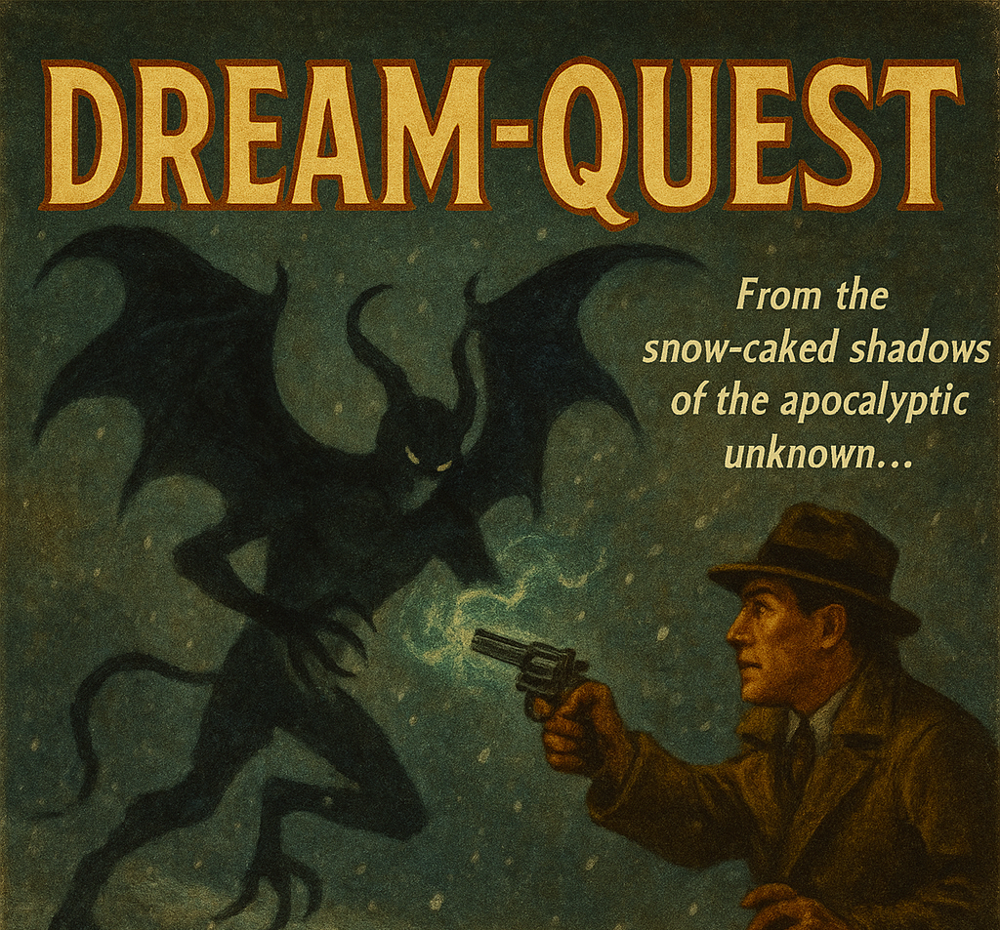

<!-- README.md for Dream-Quest -->

<p align="center">
  
</p>

<h1 align="center">
  <font face="UnifrakturCook">❄ The Endless Winter is Upon Us… ❄</font>
</h1>

> _Generated with help from ChatGPT_

---

📜 **A Most Chilling Project Appears!**

Behold! [_Dream-Quest_](https://github.com/Soul-8691/Dream-Quest) — a 2D survival horror journey through icy post-apocalyptic wastes, summoned for **Mana's 2D Horror Game Jam #4**.

☃️ **Theme:** Post-apocalyptic  
🎮 **Engine:** Godot  
🧊 **Setting:** The desolate dreamworlds of **Innsmouth** and **Antarctica**, remnants of Earth haunted by memory and madness  
🧙 **Feature:** A mysterious **vendor** trades **arcane cards** imbued with eldritch power. But beware — **every card has a cost**.

---

## 🧠 What is *Dream-Quest*?

> In the aftermath of the world's destruction, Nyarlathotep — the crawling chaos — has turned existence into a cruel game.

You are the chosen soul in a shattered world shaped by dreams. Nyarlathotep has shattered reality and left behind a **snowbound dreamscape**, governed by his whim. In opposition stands **Nodens**, a rare force of benevolence, who grants humans a chance — *a game of monsters and cards*. Each victory restores a fragment of Earth... but failure seals it forever.

As you traverse this frigid dimension known as **Niffl**, you encounter terrifying beings. But combat is not fought with weapons alone — each monster **demands a duel by cards**, where even **your soul is a stake**.

Win, and you gain their power. Lose, and become another forgotten whisper in the storm.

---

## 🃏 Card Game Mechanics

> _The cold isn't your only enemy..._

Your fate rests in a complex strategic card battle system, inspired by tactical dueling games with a cosmic horror twist:

- **Deck Size:** 60 cards (15–20 must be characters or monsters)  
- **Card Types:**  
  - Character Cards  
  - Monster Cards  
  - Weapon Cards *(equip to characters)*  
  - Magic Cards *(equip to monsters)*  
  - Exposition Cards *(Settings & Story)*  
- **Arcane System:**  
  - Characters gain **Arcane** by encountering horrors  
  - Arcane gives powerful bonuses—but also madness-inducing debuffs  
  - Monsters start with Arcane and can inflict effects like **Frenzy**  
- **Check Mechanic:**  
  - Each player begins with 5 face-down “checks” — test points that must be defeated before direct attacks  
  - Checks contain monsters/characters used in combat as defense  
  - Once all checks are gone, the opponent’s **life point tokens** (starts at 20) become vulnerable  

---

### 💥 Turn Phases

1. **Draw Phase** – Draw 1 card (max 6 in hand)  
2. **Exposition Phase** – Place Story/Setting cards and update resources  
3. **Main Phase** – Place monsters/characters; update Arcane  
4. **Equip Phase** – Attach weapons/magic  
5. **Battle Phase** – Declare attacks or enter defense mode  
6. **End Phase** – Remove exhausted resources  

---

### ⚖️ Alignment & Resource System

- Every resource card has an **alignment** (e.g., Cults, Institutions)  
- Characters/monsters benefit more from aligned resources  
- Playing a card requires spending resource tokens equal to its attack or defense  
- Some resources are permanent in story mode; others are consumed when depleted  
- Alignment matches grant **+2 ATK/DEF** and possible special effects

---

### 🎴 Tactical Considerations

- Only 1 character/monster, 1 resource, and 1 equip card may be played per turn  
- Cards have ATK/DEF values from 1–20  
- Positioning (attack/defense), flip effects, and targeting mechanics are critical  
- The **outside bounds area** allows positioning units that don’t block check attacks

---

```diff
+ Face the dream-twisted horrors of Innsmouth and Antarctica
+ Earn your enemies' souls and power by defeating them in battle
+ Align yourself with cults or institutions to manipulate your deck’s potential
+ Wield Arcane power, but beware the creeping madness it brings
+ Survive Nyarlathotep’s game... or fall into oblivion
